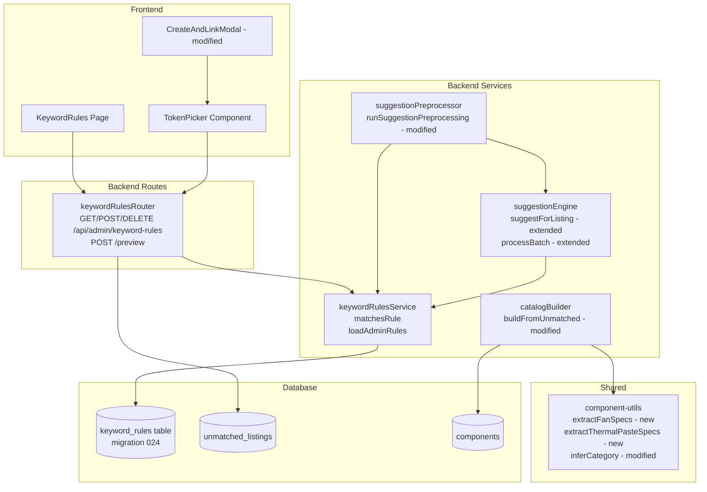
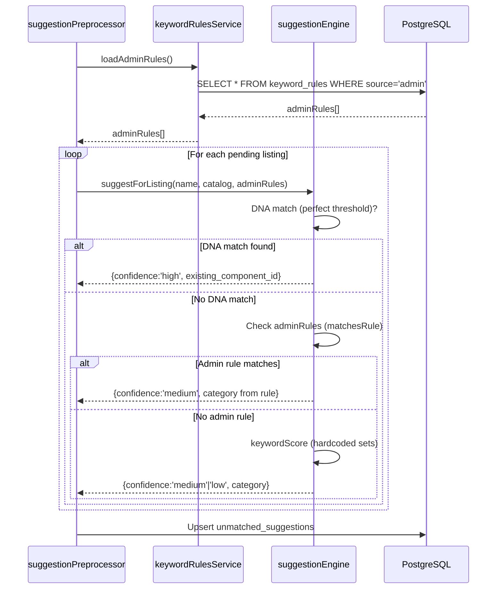

# Design Document — Keyword Rules Engine

## Overview

The Keyword Rules Engine extends the existing Smart Catalog Expansion system with admin-configurable keyword→category mappings stored in a database table. Currently, the suggestion engine's keyword sets are hardcoded in `suggestionEngine.ts` — admins cannot add, remove, or inspect them without a code deployment.

This design introduces five coordinated improvements:

1. **Engine fixes** — AIO radiator `number_before` match type, `fan`/`thermal_paste` auto-creation in `catalogBuilder.ts`, and HTML entity cleanup.
2. **Keyword Rules DB + Backend** — a `keyword_rules` table with four match types, loaded at runtime before the hardcoded sets.
3. **Token Picker** — clickable word chips inside the existing Create & Link Modal for inline rule creation.
4. **Keyword Rules Admin Page** — a dedicated `/admin/keyword-rules` page for viewing and managing all rules.
5. **catalogBuilder improvements** — `fan` and `thermal_paste` creation paths with spec extraction.

### Key Design Decisions

**Admin rules are checked before hardcoded sets, but after DNA matching.** DNA matching (perfect/partial threshold) always takes precedence. Admin rules only affect the keyword scoring phase. This preserves the existing high-confidence behavior while allowing admins to fill gaps.

**The `matchesRule` function is the single source of truth for matching logic.** Both the suggestion engine and the preview endpoint use the same pure function, guaranteeing that `match_count` in the preview is accurate.

**Built-in rules are seeded from `KEYWORD_SETS` for transparency only.** The hardcoded sets remain in `suggestionEngine.ts` as the final fallback. The DB built-in rows are read-only display artifacts — the engine does not load them at runtime (it uses the hardcoded arrays directly).

**Admin rules are loaded once per batch run.** `runSuggestionPreprocessing` loads all `source='admin'` rules once before the loop, then passes the snapshot to `processBatch`. This avoids N+1 DB queries and ensures all listings in a batch see the same rule set.

---

## Architecture

The feature touches four layers: database, backend services, backend routes, and frontend.



### Data Flow: Suggestion Preprocessing with Admin Rules



---

## Components and Interfaces

### New: `keywordRulesService.ts`

The core service module. All functions are pure or DB-only — no HTTP concerns.

```typescript
export interface KeywordRule {
  id: number;
  keyword: string;
  match_type: 'contains' | 'word' | 'starts_with' | 'number_before';
  category: string;
  source: 'admin' | 'builtin';
  created_by: number | null;
  created_at: string;
}

/**
 * Pure function — tests whether a scraped name matches a keyword rule.
 * This is the single source of truth for matching logic used by both
 * the suggestion engine and the preview endpoint.
 */
export function matchesRule(rule: Pick<KeywordRule, 'keyword' | 'match_type'>, name: string): boolean

/**
 * Loads all admin-created rules from the DB.
 * Called once per batch run by suggestionPreprocessor.
 */
export async function loadAdminRules(): Promise<KeywordRule[]>
```

**Match type implementations** (internal, never exposed to admin):

| Match Type | Implementation |
|---|---|
| `contains` | `name.toLowerCase().includes(keyword.toLowerCase())` |
| `word` | `new RegExp('\\b' + escapeRegex(keyword) + '\\b', 'i').test(name)` |
| `starts_with` | `name.toLowerCase().startsWith(keyword.toLowerCase())` |
| `number_before` | `new RegExp('\\d+' + escapeRegex(keyword) + '\\b', 'i').test(name)` |

The `escapeRegex` helper escapes all special regex characters in the keyword before constructing the pattern.

### Modified: `suggestionEngine.ts`

`suggestForListing` gains an optional `adminRules` parameter:

```typescript
export function suggestForListing(
  scrapedName: string,
  catalog: CatalogComponent[],
  adminRules?: KeywordRule[]
): Suggestion
```

`processBatch` gains the same parameter and passes it through:

```typescript
export function processBatch(
  listings: Array<{ id: number; scraped_name: string }>,
  catalog: CatalogComponent[],
  adminRules?: KeywordRule[]
): Map<number, Suggestion>
```

The admin rule check is inserted between the partial DNA match step and the hardcoded keyword scorer:

```
1. DNA perfect match → confidence: 'high'
2. DNA partial match → confidence: 'medium'
3. Admin rules check (NEW) → confidence: 'medium' if single-category consensus
4. Hardcoded keyword scorer → confidence: 'medium' or 'low'
```

When multiple admin rules match but disagree on category, the engine falls through to step 4 as if no admin rules matched.

### Modified: `suggestionPreprocessor.ts`

`runSuggestionPreprocessing` loads admin rules once before the batch loop:

```typescript
// Step 1: Load catalog
// Step 1b: Load admin rules (NEW)
const adminRules = await loadAdminRules();
// Step 2: Fetch pending listings
// Step 3: processBatch(pending, catalog, adminRules)  ← adminRules passed here
// Step 4: Upsert results
```

### New: `keywordRulesRouter.ts`

Mounted at `/api/admin/keyword-rules`. All routes protected by `authMiddleware`.

| Method | Path | Description |
|---|---|---|
| `GET` | `/` | List all rules (admin + builtin) with `match_count` |
| `POST` | `/` | Create admin rule |
| `DELETE` | `/:id` | Delete admin rule (403 for builtin) |
| `POST` | `/preview` | Preview match count for keyword+match_type |

### Modified: `shared/component-utils.ts`

Two new spec extractors added alongside existing ones:

```typescript
export function extractFanSpecs(name: string): {
  size_mm: number;      // from 120mm/140mm/200mm patterns, default 120
  rgb: boolean;         // from 'rgb' or 'argb' in name
  pack_size: number;    // from triple/3x/dual/twin/2x patterns, default 1
}

export function extractThermalPasteSpecs(name: string): {
  weight_grams: number | null;  // from 4g/8g/1 gramme patterns, null if not found
  paste_type: 'paste' | 'liquid_metal' | 'pad';  // from name keywords
}
```

`inferCategory` is modified to return `'fan'` and `'thermal_paste'` for matching names. The fan check is placed after the cooling check (cooling takes precedence). The thermal paste check is placed before the final `return null`.

### Modified: `catalogBuilder.ts`

Two new branches added to the category switch in `buildFromUnmatched`:

```typescript
} else if (category === 'fan') {
  const specs = extractFanSpecs(scrapedName);
  const rows = await sql`
    INSERT INTO components (slug, name, brand, category, size_mm, rgb, pack_size, is_active)
    VALUES (${slug}, ${cleanedName}, ${brand}, 'fan', ${specs.size_mm}, ${specs.rgb}, ${specs.pack_size}, true)
    RETURNING id
  ` as { id: number }[];
  newId = rows[0]?.id;
} else if (category === 'thermal_paste') {
  const specs = extractThermalPasteSpecs(scrapedName);
  const rows = await sql`
    INSERT INTO components (slug, name, brand, category, weight_grams, paste_type, is_active)
    VALUES (${slug}, ${cleanedName}, ${brand}, 'thermal_paste', ${specs.weight_grams}, ${specs.paste_type}, true)
    RETURNING id
  ` as { id: number }[];
  newId = rows[0]?.id;
}
```

### New Frontend Components

**`TokenPicker.tsx`** — Renders a scraped name as clickable word chips. Classifies tokens using the same `COLOR_TOKENS` + `NOISE_TOKENS` lists as `deriveCanonicalName`. Noise tokens are greyed-out and non-interactive. Meaningful tokens are blue and clickable. Clicking a token opens an inline panel with match type radio buttons, category dropdown, Preview button, and Save rule button. Only one panel is open at a time.

**`AddRuleModal.tsx`** — A standalone modal for creating rules from the Keyword Rules page. Contains keyword input, match type radio buttons, category dropdown, Preview button, and Save button (disabled until preview is run).

**`KeywordRules.tsx`** — The main admin page at `/admin/keyword-rules`. Displays a table of all rules with search/filter, an "Add rule" button, and delete actions for admin rules.

---

## Data Models

### `keyword_rules` Table (migration 024)

```sql
CREATE TABLE keyword_rules (
  id          SERIAL PRIMARY KEY,
  keyword     VARCHAR(200) NOT NULL,
  match_type  VARCHAR(20)  NOT NULL DEFAULT 'contains'
                CHECK (match_type IN ('contains','word','starts_with','number_before')),
  category    VARCHAR(50)  NOT NULL
                CHECK (category IN ('cpu','gpu','ram','motherboard','storage','psu','case','cooling','fan','thermal_paste')),
  source      VARCHAR(10)  NOT NULL CHECK (source IN ('admin','builtin')),
  created_by  INTEGER REFERENCES admins(id) ON DELETE SET NULL,
  created_at  TIMESTAMPTZ NOT NULL DEFAULT NOW(),
  UNIQUE (keyword, category, match_type)
);

CREATE INDEX idx_keyword_rules_source  ON keyword_rules (source);
CREATE INDEX idx_keyword_rules_keyword ON keyword_rules (keyword);
```

The migration also seeds built-in rules from `KEYWORD_SETS` using `ON CONFLICT DO NOTHING` for idempotency.

### API Response Types

**`GET /api/admin/keyword-rules`** response:
```typescript
interface KeywordRuleResponse {
  id: number;
  keyword: string;
  match_type: 'contains' | 'word' | 'starts_with' | 'number_before';
  category: string;
  source: 'admin' | 'builtin';
  created_by: number | null;
  created_at: string;
  match_count: number;  // live count of pending listings matching this rule
}
```

**`POST /api/admin/keyword-rules/preview`** response:
```typescript
interface PreviewResponse {
  match_count: number;
  sample_names: string[];  // up to 5 example scraped names
}
```

### `match_count` Computation

The `match_count` for `GET /api/admin/keyword-rules` is computed in a single SQL query using a lateral subquery — not N+1 queries:

```sql
SELECT
  kr.*,
  (
    SELECT COUNT(*)
    FROM unmatched_listings ul
    WHERE ul.status = 'pending'
      AND ul.scraped_name ILIKE '%' || kr.keyword || '%'
  ) AS match_count
FROM keyword_rules kr
ORDER BY kr.source ASC, kr.created_at DESC
```

Note: The `match_count` in the list endpoint uses a simple `ILIKE '%keyword%'` for performance. The preview endpoint uses the full `matchesRule` logic (which handles all four match types) for accuracy. This is an intentional tradeoff — the list view gives a fast approximation, while the preview gives the exact count before saving.

---

## Correctness Properties

*A property is a characteristic or behavior that should hold true across all valid executions of a system — essentially, a formal statement about what the system should do. Properties serve as the bridge between human-readable specifications and machine-verifiable correctness guarantees.*

### Property 1: Admin Rule Priority Over Keyword Scorer

*For any* scraped name N and any non-empty list of admin rules where all matching rules agree on a single category C, when no DNA match exists, `suggestForListing(N, catalog, adminRules)` SHALL return `category = C` with `confidence = 'medium'`, regardless of what the hardcoded keyword scorer would return.

**Validates: Requirements 7.2, 7.3, 19.1, 19.2**

### Property 2: Conflicting Admin Rules Fall Through to Keyword Scorer

*For any* scraped name N and any list of admin rules where matching rules disagree on category, `suggestForListing(N, catalog, adminRules)` SHALL return the same result as `suggestForListing(N, catalog, [])` — i.e., the hardcoded keyword scorer result.

**Validates: Requirements 7.4**

### Property 3: number_before Match Type Correctness

*For any* keyword string K (non-empty) and any positive integer N, `matchesRule({ keyword: K, match_type: 'number_before' }, String(N) + K)` SHALL return `true`. Conversely, `matchesRule({ keyword: K, match_type: 'number_before' }, K)` SHALL return `false` (keyword alone, no number prefix).

**Validates: Requirements 1.1, 1.2**

### Property 4: Preview Count Matches Engine Matching Logic

*For any* keyword K and match_type M, the `match_count` returned by `POST /api/admin/keyword-rules/preview` with `{ keyword: K, match_type: M }` SHALL equal the count of rows in `unmatched_listings` with `status = 'pending'` where `matchesRule({ keyword: K, match_type: M }, scraped_name)` returns `true` at the time of the request.

**Validates: Requirements 8.9, 1.5**

### Property 5: Token Classification Correctness

*For any* token string T: if T appears in `COLOR_TOKENS` or `NOISE_TOKENS`, or has `length <= 1`, then `classifyToken(T)` SHALL return `'noise'`. If T does not appear in either list and has `length > 1`, then `classifyToken(T)` SHALL return `'meaningful'`.

**Validates: Requirements 10.2**

### Property 6: Rule Deletion Does Not Corrupt Linked Data

*For any* `scraper_mappings` row M that existed before a keyword rule deletion: after deleting any keyword rule, M SHALL still exist with the same `component_id`, `retailer_id`, and `product_url`. The count of rows in `scraper_mappings`, `components`, and `unmatched_listings` SHALL be unchanged by a keyword rule deletion.

**Validates: Requirements 17.1, 17.2**

### Property 7: inferCategory Fan/Thermal Paste Does Not Regress Existing Categories

*For any* scraped name N where the current `inferCategory(N)` returns a non-null category C (one of cpu, gpu, ram, motherboard, storage, psu, cooling, case): after the Requirement 3 changes, `inferCategory(N)` SHALL still return C. The fan and thermal_paste detection paths SHALL only activate for names that currently return `null`.

**Validates: Requirements 3.3, 3.4, 3.5, 20.9**

### Property 8: decodeHtml Idempotence

*For any* string S that contains no HTML entities (no `&`, `&#`, or `&word;` patterns), `decodeHtml(S)` SHALL equal `S`. Applying `decodeHtml` twice SHALL produce the same result as applying it once: `decodeHtml(decodeHtml(S)) === decodeHtml(S)`.

**Validates: Requirements 4.4**

---

## Error Handling

### Backend Route Errors

All error responses follow the project standard:
```json
{ "error": { "code": "ERROR_CODE", "message": "Human-readable message" } }
```

| Scenario | HTTP Status | Error Code |
|---|---|---|
| Unauthenticated request | 401 | `UNAUTHORIZED` |
| Invalid category value | 400 | `INVALID_CATEGORY` |
| Empty or too-long keyword | 400 | `INVALID_KEYWORD` |
| Invalid match_type value | 400 | `INVALID_MATCH_TYPE` |
| Duplicate keyword+category+match_type | 409 | `DUPLICATE_RULE` |
| Delete builtin rule | 403 | `CANNOT_DELETE_BUILTIN` |
| Rule ID not found | 404 | `NOT_FOUND` |

### Service-Level Error Handling

`loadAdminRules()` — if the DB query fails, the error propagates to `runSuggestionPreprocessing`, which logs it and returns `{ processed: 0, skipped: pending.length }`. The batch is not partially processed with stale rules.

`matchesRule()` — pure function, no I/O. Invalid regex patterns (from malformed keywords) are caught with a try/catch that returns `false`, preventing a single bad rule from crashing the engine.

### Frontend Error Handling

- Preview failures display an inline error message without closing the panel/modal.
- Rule creation 409 (duplicate) displays "A rule for this keyword + match type + category already exists."
- Rule creation 400 displays the server's validation message.
- Delete failures display a toast error.
- All API calls use the existing `request()` wrapper in `api.ts`, which handles 401 auto-refresh.

---

## Testing Strategy

### Unit Tests (example-based)

Located in `apps/backend/src/services/__tests__/keywordRulesService.test.ts`:

- `matchesRule` with each of the four match types — concrete examples
- `matchesRule` with special regex characters in keyword (e.g., `C++`, `M.2`) — verifies `escapeRegex` works
- `matchesRule` with `number_before` — `240ML` matches, `ML` alone does not, `HTML` does not
- `matchesRule` with `word` — `"DDR4"` matches `"Corsair DDR4 3200"` but not `"DDR4X"`
- `inferCategory` with fan names — `"Noctua NF-A12x25 120mm PWM"` → `'fan'`
- `inferCategory` with thermal paste names — `"Thermal Grizzly Kryonaut 1g"` → `'thermal_paste'`
- `inferCategory` non-regression — existing known names still return correct categories
- `decodeHtml` idempotence — clean strings unchanged, entity strings decoded once

Located in `apps/backend/scraper/__tests__/catalogBuilder.test.ts` (additions):

- `buildFromUnmatched` with fan listing — creates component with `category='fan'`, `size_mm`, `rgb`, `pack_size`
- `buildFromUnmatched` with thermal paste listing — creates component with `category='thermal_paste'`, `weight_grams`, `paste_type`
- `buildFromUnmatched` with HTML entity in name — inserted component name is clean

### Property-Based Tests

Located in `apps/backend/src/services/__tests__/keywordRulesService.pbt.test.ts`:

Uses `fast-check` (already available in the project or to be added as a dev dependency).

Each property test runs a minimum of 100 iterations.

**Property 1 — Admin Rule Priority:**
```
// Feature: keyword-rules-engine, Property 1: Admin rule priority over keyword scorer
fc.property(
  fc.string({ minLength: 1 }),  // scraped name
  fc.string({ minLength: 1 }),  // keyword that is a substring of the name
  fc.constantFrom('cpu','gpu','ram','motherboard','storage','psu','case','cooling','fan','thermal_paste'),
  (name, keyword, category) => {
    const nameWithKeyword = name + keyword + name;  // ensure keyword is present
    const adminRules = [{ id: 1, keyword, match_type: 'contains', category, source: 'admin', created_by: null, created_at: '' }];
    const result = suggestForListing(nameWithKeyword, [], adminRules);
    // When no catalog (no DNA match possible), admin rule should win
    return result.category === category;
  }
)
```

**Property 3 — number_before Match Type:**
```
// Feature: keyword-rules-engine, Property 3: number_before match type correctness
fc.property(
  fc.string({ minLength: 1, maxLength: 20 }).filter(s => /^[a-zA-Z]+$/.test(s)),
  fc.integer({ min: 1, max: 9999 }),
  (keyword, num) => {
    const rule = { keyword, match_type: 'number_before' as const };
    const matchingName = `${num}${keyword}`;
    const nonMatchingName = keyword;  // no number prefix
    return matchesRule(rule, matchingName) === true
        && matchesRule(rule, nonMatchingName) === false;
  }
)
```

**Property 5 — Token Classification:**
```
// Feature: keyword-rules-engine, Property 5: Token classification correctness
fc.property(
  fc.string({ minLength: 1, maxLength: 30 }),
  (token) => {
    const isNoise = COLOR_TOKENS.includes(token.toLowerCase())
                 || NOISE_TOKENS.includes(token.toLowerCase())
                 || token.length <= 1;
    const result = classifyToken(token);
    return isNoise ? result === 'noise' : result === 'meaningful';
  }
)
```

**Property 7 — inferCategory Non-Regression:**
```
// Feature: keyword-rules-engine, Property 7: inferCategory fan/thermal paste does not regress
// Uses a fixed corpus of known product names with expected categories
const KNOWN_NAMES: Array<[string, ComponentCategory]> = [
  ['AMD Ryzen 5 5600X', 'cpu'],
  ['MSI RTX 4070 Gaming X', 'gpu'],
  ['Corsair Vengeance DDR5 5600MHz 32GB', 'ram'],
  // ... full corpus
];
fc.property(
  fc.constantFrom(...KNOWN_NAMES),
  ([name, expectedCategory]) => inferCategory(name) === expectedCategory
)
```

**Property 8 — decodeHtml Idempotence:**
```
// Feature: keyword-rules-engine, Property 8: decodeHtml idempotence
fc.property(
  fc.string(),
  (s) => {
    const once = decodeHtml(s);
    const twice = decodeHtml(once);
    return once === twice;
  }
)
```

### Integration Tests

Located in `apps/backend/src/routes/admin/__tests__/keywordRules.test.ts`:

- `GET /api/admin/keyword-rules` — returns array with `match_count` field
- `POST /api/admin/keyword-rules` — creates rule, returns 201
- `POST /api/admin/keyword-rules` duplicate — returns 409 `DUPLICATE_RULE`
- `POST /api/admin/keyword-rules` invalid category — returns 400 `INVALID_CATEGORY`
- `POST /api/admin/keyword-rules` empty keyword — returns 400 `INVALID_KEYWORD`
- `DELETE /api/admin/keyword-rules/:id` admin rule — deletes successfully
- `DELETE /api/admin/keyword-rules/:id` builtin rule — returns 403 `CANNOT_DELETE_BUILTIN`
- `DELETE /api/admin/keyword-rules/:id` non-existent — returns 404
- `POST /api/admin/keyword-rules/preview` — returns `match_count` and `sample_names`
- Unauthenticated requests to all endpoints — return 401

### Frontend Tests

Located alongside components using `bun test`:

- `TokenPicker` renders chips for a scraped name
- `TokenPicker` classifies noise tokens correctly (greyed-out)
- `TokenPicker` classifies meaningful tokens correctly (clickable)
- `TokenPicker` opens inline panel on chip click
- `TokenPicker` closes first panel when second chip is clicked
- `AddRuleModal` Save button disabled until preview is run
- `KeywordRules` page renders table with correct columns
