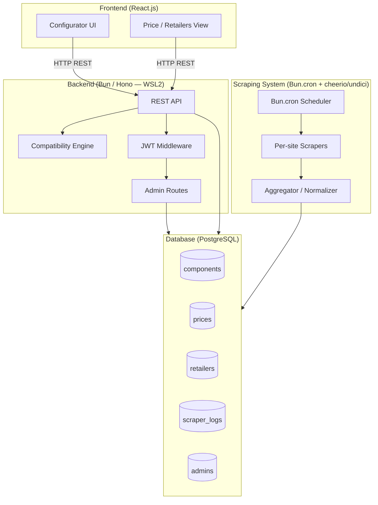

# Design Document — PC Builder Web Platform (Morocco)

## Overview

The platform is a full-stack web application that allows Moroccan users to compose a custom PC build, validate component compatibility in real time, and compare prices from local retailers. It is built on three main layers:

1. **React.js Frontend** — Responsive user interface (configurator, component pages, build summary). Built with Vite.
2. **Bun / Hono Backend** — REST API exposing business logic (compatibility, catalog, admin authentication, logs). Runs inside WSL2.
3. **Scraping System** — Scheduled scripts using `cheerio` + `undici`, triggered by `Bun.cron()`, that extract prices and stock from Moroccan e-commerce sites and populate the PostgreSQL database.

> **Runtime environment:** Backend runs on **Bun** (v1.3+) inside **WSL2** on Windows. The frontend is developed with Node.js/Vite on the Windows side or also inside WSL2.

### Key Architectural Decisions

| Decision | Choice | Rationale |
|---|---|---|
| Runtime | `Bun` (WSL2) | 3-4x faster than Node.js, built-in TypeScript, built-in test runner, built-in SQL client and cron scheduler |
| Backend framework | `Hono` | 2-3x faster than Express, TypeScript-first, runs natively on Bun, near-identical API surface to Express |
| DB access | `Bun.sql` (built-in) | Native PostgreSQL client in Bun 1.2+, no extra dependency, parameterized queries built-in |
| Input validation | `zod` | Declarative schemas, TypeScript inference, precise error messages |
| Admin authentication | JWT (jsonwebtoken) | Stateless, well-suited for REST APIs, easy to secure |
| Scraping scheduler | `Bun.cron()` (built-in) | Native to Bun 1.3+, no external dependency needed |
| Scraping | `cheerio` + `undici` | Crawlee is Node.js-only with no Bun support; cheerio + undici is lighter, faster, and fully Bun-compatible for HTML scraping |
| Product name normalization | Explicit `component_id` mapping in each scraper | Maximum reliability: each scraper targets a known component |

---

## Architecture

### Overview



### Main Data Flows

**Flow 1 — Component selection and compatibility validation:**
```
User selects a component
  → POST /api/compatibility/validate
  → Compatibility Engine (socket, RAM, GPU, PSU rules)
  → JSON response { compatible: bool, warnings: [], errors: [] }
  → Frontend updates the build summary
```

**Flow 2 — Price consultation:**
```
User opens a component detail page
  → GET /api/components/:id/prices
  → PostgreSQL query on prices JOIN retailers
  → Response sorted by ascending price with last_updated
```

**Flow 3 — Scraping cycle (every 24h):**
```
Bun.cron() triggers the job
  → cheerio + undici scrapers (one per referenced site)
  → Extract price + stock by component_id
  → Aggregator: UPSERT into prices via Bun.sql, INSERT into scraper_logs
  → Errors logged in scraper_logs without interruption
```

---

## Components and Interfaces

### Backend — Module Structure

```
backend/
├── src/
│   ├── app.ts                  # Hono app setup, route registration
│   ├── server.ts               # Entry point, Bun.serve()
│   ├── db/
│   │   └── migrations/         # SQL migration scripts
│   ├── routes/
│   │   ├── components.ts       # GET /api/components, GET /api/components/:id
│   │   ├── prices.ts           # GET /api/components/:id/prices
│   │   ├── compatibility.ts    # POST /api/compatibility/validate
│   │   ├── admin/
│   │   │   ├── components.ts   # CRUD components (JWT-protected)
│   │   │   └── logs.ts         # GET scraper logs (JWT-protected)
│   │   └── auth.ts             # POST /api/auth/login
│   ├── middleware/
│   │   ├── auth.ts             # JWT verification
│   │   └── validate.ts         # Zod request body validation
│   ├── services/
│   │   ├── compatibilityService.ts  # Compatibility business logic
│   │   └── componentService.ts      # Component data access (Bun.sql)
│   └── schemas/
│       └── componentSchemas.ts      # Zod schemas per category
├── scraper/
│   ├── scheduler.ts            # Bun.cron(), triggers every 24h
│   ├── aggregator.ts           # UPSERT prices, INSERT logs (Bun.sql)
│   ├── scrapers/
│   │   ├── baseScraper.ts      # Abstract base class (cheerio + undici)
│   │   ├── site1Scraper.ts     # Scraper for e-commerce site 1
│   │   └── site2Scraper.ts     # Scraper for e-commerce site 2
│   └── utils/
│       └── logger.ts           # Structured logger → scraper_logs
├── package.json
└── tsconfig.json
```

### REST API — Main Endpoints

| Method | Endpoint | Auth | Description |
|---|---|---|---|
| GET | `/api/components` | No | List components, filterable by `category`, `socket`, `ram_type` |
| GET | `/api/components/:id` | No | Component detail |
| GET | `/api/components/:id/prices` | No | Price offers sorted by ascending price |
| POST | `/api/compatibility/validate` | No | Validate a build, returns errors/warnings |
| POST | `/api/auth/login` | No | Admin authentication, returns JWT |
| POST | `/api/admin/components` | JWT | Add a component |
| PUT | `/api/admin/components/:id` | JWT | Update a component |
| DELETE | `/api/admin/components/:id` | JWT | Delete a component |
| GET | `/api/admin/logs` | JWT | Scraper logs, filterable by date/site/severity |

### Compatibility Engine Interface

```javascript
// Input
{
  cpu: { id, socket, tdp },
  motherboard: { id, socket, supported_ram_types, max_ram_frequency, tdp },
  gpu: { id, length_mm, tdp },
  ram: { id, ram_type, frequency_mhz, tdp },
  storage: { id, tdp },
  psu: { id, wattage },
  case: { id, max_gpu_length_mm }
}

// Output
{
  compatible: boolean,
  total_tdp: number,
  recommended_psu_wattage: number,
  errors: [
    { rule: "socket_mismatch", components: ["cpu", "motherboard"], message: "..." }
  ],
  warnings: [
    { rule: "ram_frequency_exceeded", components: ["ram", "motherboard"], message: "..." },
    { rule: "psu_underpowered", components: ["psu"], message: "..." }
  ]
}
```

### Scraper Interface

```javascript
// Contract for each scraper (baseScraper.ts)
class BaseScraper {
  async scrape(): Promise<ScrapedPrice[]>
  // Uses undici for HTTP requests and cheerio for HTML parsing
}

// ScrapedPrice
{
  component_id: number,   // Component ID in the DB
  retailer_id: number,    // Retailer ID in the DB
  price: number,          // Price in MAD
  in_stock: boolean,
  product_url: string,
  scraped_at: Date
}
```

---

## Data Models

### PostgreSQL Schema

```sql
-- Components (polymorphic table with category-specific columns)
CREATE TABLE components (
    id              SERIAL PRIMARY KEY,
    name            VARCHAR(255) NOT NULL,
    brand           VARCHAR(100),
    category        VARCHAR(50) NOT NULL CHECK (category IN (
                        'cpu', 'motherboard', 'gpu', 'ram',
                        'storage', 'psu', 'case'
                    )),
    -- CPU / Motherboard fields
    socket          VARCHAR(50),          -- e.g. AM5, LGA1700
    -- Motherboard fields
    supported_ram_types  VARCHAR(20)[],   -- e.g. {DDR4, DDR5}
    max_ram_frequency    INTEGER,         -- in MHz
    -- RAM fields
    ram_type        VARCHAR(10),          -- DDR4 or DDR5
    frequency_mhz   INTEGER,
    -- GPU fields
    length_mm       INTEGER,             -- length in mm
    -- Case fields
    max_gpu_length_mm INTEGER,
    -- PSU fields
    wattage         INTEGER,             -- in watts
    -- Common power field
    tdp             INTEGER,             -- in watts (NULL if not applicable)
    created_at      TIMESTAMPTZ DEFAULT NOW(),
    updated_at      TIMESTAMPTZ DEFAULT NOW()
);

-- Retailers
CREATE TABLE retailers (
    id          SERIAL PRIMARY KEY,
    name        VARCHAR(100) NOT NULL UNIQUE,
    base_url    VARCHAR(255) NOT NULL,
    active      BOOLEAN DEFAULT TRUE
);

-- Scraped prices (one row per component × retailer)
CREATE TABLE prices (
    id              SERIAL PRIMARY KEY,
    component_id    INTEGER NOT NULL REFERENCES components(id) ON DELETE CASCADE,
    retailer_id     INTEGER NOT NULL REFERENCES retailers(id) ON DELETE CASCADE,
    price           NUMERIC(10, 2) NOT NULL,
    in_stock        BOOLEAN NOT NULL DEFAULT FALSE,
    product_url     VARCHAR(500) NOT NULL,
    last_updated    TIMESTAMPTZ NOT NULL DEFAULT NOW(),
    UNIQUE (component_id, retailer_id)
);

-- Scraper logs
CREATE TABLE scraper_logs (
    id          SERIAL PRIMARY KEY,
    level       VARCHAR(10) NOT NULL CHECK (level IN ('INFO', 'WARNING', 'ERROR')),
    site        VARCHAR(100),
    message     TEXT NOT NULL,
    created_at  TIMESTAMPTZ DEFAULT NOW()
);

-- Administrators
CREATE TABLE admins (
    id              SERIAL PRIMARY KEY,
    username        VARCHAR(100) NOT NULL UNIQUE,
    password_hash   VARCHAR(255) NOT NULL,
    created_at      TIMESTAMPTZ DEFAULT NOW()
);
```

### Recommended Indexes

```sql
CREATE INDEX idx_components_category ON components(category);
CREATE INDEX idx_components_socket ON components(socket) WHERE socket IS NOT NULL;
CREATE INDEX idx_prices_component_id ON prices(component_id);
CREATE INDEX idx_prices_last_updated ON prices(last_updated);
CREATE INDEX idx_scraper_logs_created_at ON scraper_logs(created_at);
CREATE INDEX idx_scraper_logs_level ON scraper_logs(level);
CREATE INDEX idx_scraper_logs_site ON scraper_logs(site);
```

### Frontend Data Models (React state)

```typescript
// Current build (local React state)
interface BuildConfiguration {
  cpu?: Component;
  motherboard?: Component;
  gpu?: Component;
  ram?: Component;
  storage?: Component;
  psu?: Component;
  case?: Component;
}

// Validation result
interface CompatibilityResult {
  compatible: boolean;
  total_tdp: number;
  recommended_psu_wattage: number;
  errors: CompatibilityIssue[];
  warnings: CompatibilityIssue[];
}

interface CompatibilityIssue {
  rule: string;
  components: string[];
  message: string;
}

// Price offer
interface PriceOffer {
  retailer_name: string;
  price: number;
  in_stock: boolean;
  product_url: string;
  last_updated: string;
}
```

---

## Correctness Properties

*A property is a characteristic or behavior that should hold true across all valid executions of a system — essentially, a formal statement about what the system should do. Properties serve as the bridge between human-readable specifications and machine-verifiable correctness guarantees.*

### Property 1: CPU / Motherboard Socket Consistency

*For any* (CPU, Motherboard) pair, the Compatibility Engine SHALL report a `socket_mismatch` error if and only if the CPU socket differs from the Motherboard socket.

**Validates: Requirements 2.1, 2.2**

---

### Property 2: RAM Type / Motherboard Consistency

*For any* (RAM, Motherboard) pair, the Compatibility Engine SHALL report a `ram_type_mismatch` error if and only if the RAM type is not in the list of types supported by the Motherboard.

**Validates: Requirements 3.1, 3.2**

---

### Property 3: RAM Frequency Exceeded Warning

*For any* (RAM, Motherboard) pair, the Compatibility Engine SHALL report a `ram_frequency_exceeded` warning if and only if the RAM frequency exceeds the maximum frequency supported by the Motherboard.

**Validates: Requirements 3.3**

---

### Property 4: Total TDP Calculation and PSU Recommendation

*For any* set of selected components (each with a TDP value), the Compatibility Engine response SHALL contain a `total_tdp` equal to the sum of all component TDPs, and a `recommended_psu_wattage` equal to `ceil(total_tdp × 1.2)`.

**Validates: Requirements 5.1, 5.2**

---

### Property 5: Underpowered PSU Warning

*For any* build where the selected PSU wattage is lower than the calculated recommended wattage, the Compatibility Engine SHALL include a `psu_underpowered` warning in the response.

**Validates: Requirements 5.3**

---

### Property 6: GPU / Case Clearance Alert

*For any* (GPU, Case) pair, the Compatibility Engine SHALL report a `gpu_too_long` error if and only if the GPU length (in mm) exceeds the maximum GPU length supported by the Case.

**Validates: Requirements 4.1, 4.2**

---

### Property 7: Price Offers Sorted in Ascending Order

*For any* list of price offers returned by `GET /api/components/:id/prices`, the offers SHALL be ordered by ascending price — that is, for every index i < j in the list, `offers[i].price <= offers[j].price`.

**Validates: Requirements 7.1**

---

### Property 8: Required Field Validation on Component Creation

*For any* component creation request where at least one required field is missing or invalid, the API SHALL return HTTP 400 with a JSON body identifying the missing field(s).

**Validates: Requirements 8.2, 8.3, 11.2**

---

### Property 9: Administration Endpoint Protection

*For any* request to an administration endpoint (POST/PUT/DELETE `/api/admin/components`, GET `/api/admin/logs`) without a valid JWT (absent, malformed, or expired), the API SHALL return HTTP 401.

**Validates: Requirements 11.3, 11.4**

---

### Property 10: Scraping Error Isolation

*For any* scraping session where one or more scrapers throw an exception, the remaining scrapers SHALL continue execution and the errors SHALL be recorded in `scraper_logs` with level `ERROR`.

**Validates: Requirements 6.4, 9.2**

---

### Property 11: Log Filtering by Criteria

*For any* request to `GET /api/admin/logs` with filter parameters (date, site, level), all returned entries SHALL satisfy all provided filter criteria — no entry should appear if it does not match the active filters.

**Validates: Requirements 9.3**

---

## Error Handling

### Global Strategy

All errors are centralized in an Express error-handling middleware. Operational errors (validation, 404, 401) return structured JSON responses. Unexpected errors are logged and return HTTP 500 without exposing internal details.

```javascript
// Standard error response format
{
  "error": {
    "code": "VALIDATION_ERROR",       // Machine-readable code
    "message": "Field 'socket' is required for category 'cpu'",
    "fields": ["socket"]              // Optional, for validation errors
  }
}
```

### Business Error Codes

| Code | HTTP | Description |
|---|---|---|
| `VALIDATION_ERROR` | 400 | Missing or invalid required field |
| `COMPONENT_NOT_FOUND` | 404 | Component not found |
| `UNAUTHORIZED` | 401 | JWT missing or invalid |
| `FORBIDDEN` | 403 | Valid JWT but insufficient role |
| `COMPATIBILITY_ERROR` | 200 | Incompatibility detected (returned in body, not as HTTP error) |
| `INTERNAL_ERROR` | 500 | Unexpected server error |

### Scraping Error Handling

The scraper adopts a **fail-fast per site, continue-on-error globally** strategy:

1. Each scraper runs inside a `try/catch` block.
2. On error (timeout, changed HTML structure, HTTP 429 blocking), the error is logged to `scraper_logs` with `level = 'ERROR'`, the site name, and a timestamp.
3. The scheduler continues with the next site without interruption.
4. At the end of the session, a summary `INFO` log is inserted with the number of components updated and the number of errors.

### Database Error Handling

- All queries use **prepared statements** via `pg` to prevent SQL injection.
- PostgreSQL constraint errors (e.g., foreign key violations) are caught and converted to HTTP 400 responses with an explicit message.
- The connection pool is configured with a timeout and a maximum number of connections to avoid resource exhaustion.

---

## Testing Strategy

### Dual Approach

The testing strategy combines **unit tests** (concrete examples, edge cases) and **property-based tests** (universal coverage via random input generation).

### Unit Tests

Targeting:
- Integration between layers (e.g., route → service → mocked DB)
- Edge cases and error conditions (e.g., component not found, expired JWT)
- Concrete compatibility examples (e.g., AM5 + AM5 = compatible, AM5 + LGA1700 = incompatible)

Framework: **Jest** (Node.js)

### Property-Based Testing (PBT)

Framework: **fast-check** (PBT library for JavaScript/TypeScript)

Configuration: minimum **100 runs** per property test.

Each property test is annotated with a traceability comment:
```
// Feature: pc-builder-platform, Property N: <property text>
```

#### Property Tests to Implement

**Property 1 — CPU / Motherboard Socket Consistency**
```javascript
// Feature: pc-builder-platform, Property 1: CPU/Motherboard socket consistency
fc.assert(fc.property(
  fc.record({ socket: fc.string({ minLength: 1 }) }),
  fc.record({ socket: fc.string({ minLength: 1 }) }),
  (cpu, motherboard) => {
    const result = validateCompatibility({ cpu, motherboard });
    const hasSocketError = result.errors.some(e => e.rule === 'socket_mismatch');
    return (cpu.socket !== motherboard.socket) === hasSocketError;
  }
), { numRuns: 100 });
```

**Property 2 — RAM Type / Motherboard Consistency**
```javascript
// Feature: pc-builder-platform, Property 2: RAM type/Motherboard consistency
fc.assert(fc.property(
  fc.record({ ram_type: fc.constantFrom('DDR4', 'DDR5') }),
  fc.record({ supported_ram_types: fc.subarray(['DDR4', 'DDR5'], { minLength: 1 }) }),
  (ram, motherboard) => {
    const result = validateCompatibility({ ram, motherboard });
    const hasRamError = result.errors.some(e => e.rule === 'ram_type_mismatch');
    return !motherboard.supported_ram_types.includes(ram.ram_type) === hasRamError;
  }
), { numRuns: 100 });
```

**Property 3 — RAM Frequency Exceeded Warning**
```javascript
// Feature: pc-builder-platform, Property 3: RAM frequency exceeded warning
fc.assert(fc.property(
  fc.record({ frequency_mhz: fc.integer({ min: 1600, max: 8000 }) }),
  fc.record({ max_ram_frequency: fc.integer({ min: 1600, max: 8000 }) }),
  (ram, motherboard) => {
    const result = validateCompatibility({ ram, motherboard });
    const hasWarning = result.warnings.some(w => w.rule === 'ram_frequency_exceeded');
    return (ram.frequency_mhz > motherboard.max_ram_frequency) === hasWarning;
  }
), { numRuns: 100 });
```

**Property 4 — Total TDP and PSU Recommendation**
```javascript
// Feature: pc-builder-platform, Property 4: Total TDP and PSU recommendation
fc.assert(fc.property(
  fc.array(fc.record({ tdp: fc.integer({ min: 0, max: 500 }) }), { minLength: 1, maxLength: 7 }),
  (components) => {
    const result = validateCompatibility({ components });
    const expectedTdp = components.reduce((sum, c) => sum + c.tdp, 0);
    const expectedPsu = Math.ceil(expectedTdp * 1.2);
    return result.total_tdp === expectedTdp && result.recommended_psu_wattage === expectedPsu;
  }
), { numRuns: 100 });
```

**Property 5 — Underpowered PSU Warning**
```javascript
// Feature: pc-builder-platform, Property 5: Underpowered PSU warning
fc.assert(fc.property(
  fc.integer({ min: 1, max: 1500 }),
  fc.integer({ min: 1, max: 1500 }),
  (recommendedWattage, psuWattage) => {
    const result = validateCompatibility({ recommendedWattage, psu: { wattage: psuWattage } });
    const hasWarning = result.warnings.some(w => w.rule === 'psu_underpowered');
    return (psuWattage < recommendedWattage) === hasWarning;
  }
), { numRuns: 100 });
```

**Property 6 — GPU / Case Clearance**
```javascript
// Feature: pc-builder-platform, Property 6: GPU/Case clearance
fc.assert(fc.property(
  fc.record({ length_mm: fc.integer({ min: 100, max: 450 }) }),
  fc.record({ max_gpu_length_mm: fc.integer({ min: 100, max: 450 }) }),
  (gpu, pcCase) => {
    const result = validateCompatibility({ gpu, case: pcCase });
    const hasError = result.errors.some(e => e.rule === 'gpu_too_long');
    return (gpu.length_mm > pcCase.max_gpu_length_mm) === hasError;
  }
), { numRuns: 100 });
```

**Property 7 — Price Offers Sorted Ascending**
```javascript
// Feature: pc-builder-platform, Property 7: Price offers sorted ascending
fc.assert(fc.property(
  fc.array(fc.record({ price: fc.float({ min: 0, max: 100000, noNaN: true }) }), { minLength: 0, maxLength: 20 }),
  (offers) => {
    const sorted = sortOffersByPrice(offers);
    for (let i = 0; i < sorted.length - 1; i++) {
      if (sorted[i].price > sorted[i + 1].price) return false;
    }
    return true;
  }
), { numRuns: 100 });
```

**Property 8 — Required Field Validation Returns 400**
```javascript
// Feature: pc-builder-platform, Property 8: Required field validation returns 400
fc.assert(fc.property(
  fc.record({
    name: fc.option(fc.string({ minLength: 1 }), { nil: undefined }),
    category: fc.option(fc.constantFrom('cpu', 'motherboard', 'gpu', 'ram', 'storage', 'psu', 'case'), { nil: undefined }),
    socket: fc.option(fc.string({ minLength: 1 }), { nil: undefined })
  }),
  async (partialComponent) => {
    const response = await request(app)
      .post('/api/admin/components')
      .set('Authorization', `Bearer ${validAdminToken}`)
      .send(partialComponent);
    const missingRequired = isMissingRequiredFields(partialComponent);
    return missingRequired ? response.status === 400 : response.status !== 400;
  }
), { numRuns: 100 });
```

**Property 9 — Admin Endpoints Require Valid JWT**
```javascript
// Feature: pc-builder-platform, Property 9: Admin endpoints require valid JWT
fc.assert(fc.property(
  fc.constantFrom(
    { method: 'post', path: '/api/admin/components' },
    { method: 'put', path: '/api/admin/components/1' },
    { method: 'delete', path: '/api/admin/components/1' },
    { method: 'get', path: '/api/admin/logs' }
  ),
  fc.option(fc.string()),
  async (endpoint, invalidToken) => {
    const req = request(app)[endpoint.method](endpoint.path);
    if (invalidToken) req.set('Authorization', `Bearer ${invalidToken}`);
    const response = await req.send({});
    return response.status === 401;
  }
), { numRuns: 100 });
```

**Property 10 — Scraping Error Isolation**
```javascript
// Feature: pc-builder-platform, Property 10: Scraper error isolation
fc.assert(fc.property(
  fc.array(fc.boolean(), { minLength: 2, maxLength: 5 }),
  async (scraperResults) => {
    const mockScrapers = scraperResults.map((succeeds, i) =>
      succeeds ? createMockScraper(i) : createFailingMockScraper(i)
    );
    const logs = [];
    await runScrapingSession(mockScrapers, logs);
    const failingCount = scraperResults.filter(r => !r).length;
    const errorLogs = logs.filter(l => l.level === 'ERROR');
    return errorLogs.length === failingCount;
  }
), { numRuns: 100 });
```

**Property 11 — Log Filtering Returns Only Matching Entries**
```javascript
// Feature: pc-builder-platform, Property 11: Log filtering returns only matching entries
fc.assert(fc.property(
  fc.record({
    level: fc.option(fc.constantFrom('INFO', 'WARNING', 'ERROR'), { nil: undefined }),
    site: fc.option(fc.string({ minLength: 1 }), { nil: undefined })
  }),
  async (filters) => {
    const response = await request(app)
      .get('/api/admin/logs')
      .set('Authorization', `Bearer ${validAdminToken}`)
      .query(filters);
    const logs = response.body.logs;
    return logs.every(log =>
      (!filters.level || log.level === filters.level) &&
      (!filters.site || log.site === filters.site)
    );
  }
), { numRuns: 100 });
```

### Integration Tests

- Full scraping cycle verification against a mock HTML test site
- Price UPSERT verification in the database
- Scraper error log recording verification

### Performance Tests

- Verify that `POST /api/compatibility/validate` responds in < 500ms under normal load (Requirement 10.1)
- Recommended tool: **autocannon** or **k6** for load testing

### Coverage Targets

- Compatibility services: 90%+
- API routes: 80%+
- Scraper aggregator: 75%+
