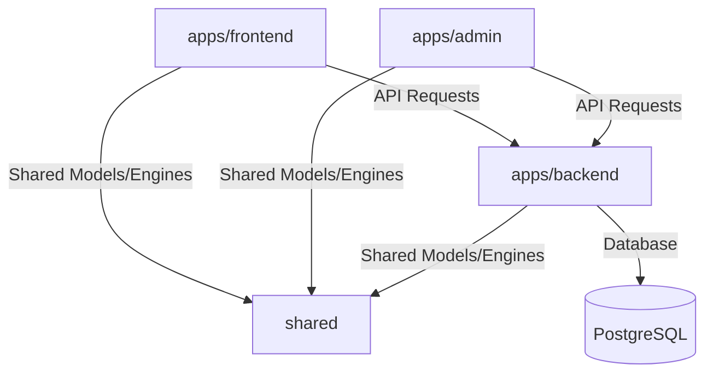

# Architecture Codemap

**Freshness Timestamp:** 2026-06-15T16:10:00Z

## Project Layout
This is a monorepo consisting of:
- `apps/backend/`: Bun/Hono API backend that handles database routing, scraper scheduling, and compatibility validation logic.
- `apps/frontend/`: React SPA with Vite and Vanilla CSS, displaying the client-facing configurator and comparing retail offers.
- `apps/admin/`: Admin dashboard SPA for component verification and scraping logs management.
- `shared/`: Common validation engines, TypeScript models, formatter utilities, and API client interfaces shared between projects.

