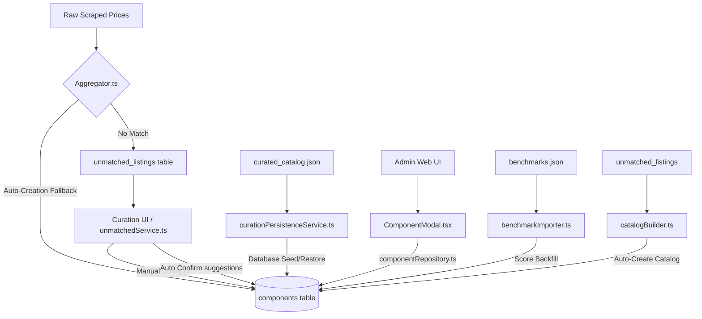

# Component Creation and Syncing Pipelines

This document details all files in the PcBuilder codebase that perform database insertions, updates, or validations for catalog components (`components` table). It explains their roles, connections, how specifications are extracted and enriched, and how to maintain them when modifying the database schema.

---

## 1. Pipelines Overview

The codebase contains five distinct pathways through which a component can be created or updated in the `components` table.

---

## 2. File-by-File Audit

### 2.1 Backend Core & API Services

#### 1. [`unmatchedService.ts`](file:///C:/Headquarters/Projects/PcBuilder/apps/backend/src/modules/scraping/unmatched/services/unmatchedService.ts)
* **Role**: Orchestrates the unmatched listings curation flow. It handles manually linking listings, bulk-approving suggestions, and creating new components from listings.
* **Connections**:
  * Calls `UnmatchedRepository` to interact with unmatched listing tables.
  * Calls `CurationPersistenceService.exportCuratedCatalog()` after modifications to keep the JSON seed in sync.
  * Imports and uses hardware extractors (`extractCpuSpecs`, `extractRamSpecs`, etc.) in `enrichSpecs()`.
* **Insertions**:
  * `bulkConfirmAllWithCategories` (Line 176): Inserts components curated through suggested matches. Now accepts an optional `category` filter parameter to scope automatic ingestion to a single category at a time.
  * `createAndLink` (Line 469): Inserts manually curated new components.
  * *Status*: Both insert blocks are fully synchronized with the database schema and write all promoted specifications (`base_clock_ghz`, `boost_clock_ghz`, `read_speed_mbps`, `write_speed_mbps`, `efficiency_rating`, `modular`, `psu_form_factor`, `mpn`, etc.).

#### 2. [`componentRepository.ts`](file:///C:/Headquarters/Projects/PcBuilder/apps/backend/src/modules/catalog/repositories/componentRepository.ts)
* **Role**: Primary catalog repository handling queries, filtering, facet generation, sorting, and manual CRUD.
* **Insertions & Updates**:
  * `createComponent` (Line 614): Inserts a component.
  * `updateComponent` (Line 621): Updates a component.
  * *Status*: Uses dynamic SQL serialization (`${this.sql(data)}`). This is fully safe and automatically matches whatever columns are supplied by the caller (Zod schema inputs), eliminating the need for manual SQL column syncing here.

#### 3. [`curationPersistenceService.ts`](file:///C:/Headquarters/Projects/PcBuilder/apps/backend/src/core/services/curationPersistenceService.ts)
* **Role**: Seeds, exports, and restores the curated catalog from `seed/curated_catalog.json`.
* **Insertions**:
  * `importCuratedCatalog` (Line 180): Inserts catalog components during DB seeding using dynamic column generation: `${ sql([comp]) }` with `ON CONFLICT (slug) DO UPDATE`.
  * *Status*: Fully synchronized. All promoted specification columns are explicitly selected in the export routine (lines 79-91) and updated in the import conflict block (lines 181-222).

---

### 2.2 Scraping Ingestion & Automation Engine

#### 4. [`catalogBuilder.ts`](file:///C:/Headquarters/Projects/PcBuilder/apps/backend/src/modules/scraping/engine/catalogBuilder.ts)
* **Role**: Automatically constructs catalog entries from unmatched scraper listings that could not be mapped to existing entries.
* **Connections**:
  * Uses hardware extractors from `@shared/hardware/specs/...` to parse specs.
  * Performs fallback deep scraping using `scrapeProductPage` to gather details from the target retailer site.
* **Insertions**:
  * Inserts components case-by-case inside category-specific `if/else` statements.
  * *Status*: **Requires Synchronization**. The CPU insertion block (lines 307-314) only writes `socket` and `tdp`. It must be updated to insert `core_count`, `thread_count`, `base_clock_ghz`, `boost_clock_ghz`, and `supported_ram_types`.

#### 5. [`aggregator.ts`](file:///C:/Headquarters/Projects/PcBuilder/apps/backend/src/modules/scraping/engine/aggregator.ts)
* **Role**: Main prices classification and matching aggregator. Processes raw scraper outputs into the `prices` and `price_history` tables.
* **Connections**:
  * Contains matching matching logic checking database mappings and hardware DNA scores.
  * Redirects unmapped components to `unmatched_listings` (Step 5).
* **Insertions**:
  * `autoCreated` block (Lines 516 & 541): Auto-creation pipeline fallback.
  * *Status*: **Requires Synchronization**. The fallback CPU block (lines 421-423) only maps `socket` and `tdp`. It must be updated to copy all parsed CPU specifications into the bulk insertion payload.

#### 6. [`benchmarkImporter.ts`](file:///C:/Headquarters/Projects/PcBuilder/apps/backend/src/modules/scraping/engine/benchmarkImporter.ts)
* **Role**: Imports benchmark data from `benchmarks.json` to backfill `benchmark_score` for CPUs and GPUs.
* **Status**: Safe. It only performs `UPDATE components SET benchmark_score = ...` and does not insert components or alter specifications.

---

### 2.3 Frontend & Schema Validation

#### 7. [`ComponentModal.tsx`](file:///C:/Headquarters/Projects/PcBuilder/apps/admin/src/components/ComponentModal.tsx)
* **Role**: React form modal on the Admin web app for manual CRUD editing of component records.
* **Connections**:
  * Validates inputs using React Hook Form and Zod schema.
  * Calls `createAdminComponent` and `updateAdminComponent` API helpers.
* **Status**: Fully synchronized. The `CATEGORY_FIELDS` definition has been updated to include inputs for all specification columns. Form load routines correctly map flat specification fields from database responses.

#### 8. [`component.schema.ts`](file:///C:/Headquarters/Projects/PcBuilder/shared/schemas/component.schema.ts)
* **Role**: Shared Zod schema validating component payloads on both Frontend (form submission) and Backend (API entry-points).
* **Status**: Fully synchronized. Defines the precise types, constraints, and validation messages for all promoted fields (e.g. `base_clock_ghz`, `boost_clock_ghz`, `read_speed_mbps`, `write_speed_mbps`, `efficiency_rating`, `modular`).

---

### 2.4 Diagnostic & Maintenance Scripts

#### 9. [`fixPollutions.ts`](file:///C:/Headquarters/Projects/PcBuilder/apps/backend/src/modules/scraping/curation/tasks/fixPollutions.ts) & [`fix_pollutions.ts`](file:///C:/Headquarters/Projects/PcBuilder/apps/backend/src/scripts/fix_pollutions.ts)
* **Role**: Maintenance tasks designed to detect and split components with high price variance (mainly RAM/storage) caused by scrapers linking different models to the same entry.
* **Insertions**: Clones existing records into new components with split listings using `INSERT INTO components`.
* **Status**: Safe. The insertion is strictly limited to the `ram` and `storage` categories and correctly maps their spec fields.

#### 10. [`rescue_data.ts`](file:///C:/Headquarters/Projects/PcBuilder/apps/backend/src/scripts/rescue_data.ts)
* **Role**: A developer utility script to create a specific RTX 5080 component and move orphaned mappings.
* **Status**: Safe. One-time developer script, not a system pipeline.

---

## 3. Schema Modification Guidelines

Whenever a new specification column is added to the `components` table, you **MUST** modify the following files to prevent data loss or drift:

1. **Database Schema & Seeding**:
   * Update the migrations to add the column.
   * Update [`curationPersistenceService.ts`](file:///C:/Headquarters/Projects/PcBuilder/apps/backend/src/core/services/curationPersistenceService.ts) (both the `SELECT` query in export and the `DO UPDATE SET` conflict block in import).
2. **Data Parsing & Ingestion**:
   * Update the hardware spec extractors in `@shared/hardware/specs/...` to parse the new column from name strings.
   * Update `enrichSpecs()` in [`unmatchedService.ts`](file:///C:/Headquarters/Projects/PcBuilder/apps/backend/src/modules/scraping/unmatched/services/unmatchedService.ts).
   * Update category insert/mapping logic in [`catalogBuilder.ts`](file:///C:/Headquarters/Projects/PcBuilder/apps/backend/src/modules/scraping/engine/catalogBuilder.ts) and [`aggregator.ts`](file:///C:/Headquarters/Projects/PcBuilder/apps/backend/src/modules/scraping/engine/aggregator.ts).
3. **Manual Validation & Forms**:
   * Update the shared Zod schema [`component.schema.ts`](file:///C:/Headquarters/Projects/PcBuilder/shared/schemas/component.schema.ts).
   * Update the React UI form fields in [`ComponentModal.tsx`](file:///C:/Headquarters/Projects/PcBuilder/apps/admin/src/components/ComponentModal.tsx).
